## No Hack No CTF 2025

This is my complete writeup for the No Hack No CTF 2025 challenges, focusing on the Crackme and gitgit challenges that I created. In this writeup, I'll explain how these challenges work and how to solve them.

## gitgit Challenge

### Challenge Overview

The challenge provides a git repository at: `https://github.com/UmmItC/gitgit` (now renamed to NHNC-gitgit). 

At first glance, you might assume this is a straightforward git challenge where you simply examine the codebase. However, it's far more complex than that. I designed this challenge to mirror real-world security incidents where developers accidentally leak sensitive files (like .env files) and attempt to cover their tracks using `git delete` and `git push --force`.

The key question is: **Can you truly hide sensitive information with a simple force push?** 

The answer is no—and that's exactly the premise of this challenge. You must recover the sensitive information I've deliberately hidden within the git repository's history.

After extensive research, I believe this is a unique challenge format that hasn't been explored in other CTFs. I'm excited to share this real-world scenario!

### Initial Investigation

You should start by approaching this like any normal developer would. First, clone the repository and examine its contents:

```bash
git clone https://github.com/UmmItC/gitgit
cd gitgit
```

Looking at the codebase, you'll notice it's a Next.js project. You should get it running:

```bash
npm install
npm run dev
```

Once the development server is running, you can see the main interface:


Clicking on the "SECURE Terminal" button reveals what appears to be a flag:


You will see something like: `NHNC{???????????????????????}`

However, this is clearly not the real flag—just a placeholder.

### Finding the Real Flag

The challenge description provides an important clue:

```
You have been hired as a security researcher for a company, tasked with investigating the security of the company's GitHub repository.

According to insider information, there may be sensitive information or confidential content hidden within this public GitHub repository that should not be visible to external parties.

Can you leverage your technical skills to successfully recover these important clues?
```

The keywords "confidential hidden" are the main hint. The flag isn't visible in the current codebase, which means you need to dig into the repository's history.

### GitHub Activity API

Here's how you can find the flag in under 30 seconds using the GitHub Activity API:

```shell
curl -L -H "Accept: application/vnd.github+json" -H "X-GitHub-Api-Version: 2022-11-28" https://api.github.com/repos/UmmItC/gitgit/activity
```

The API response will show various repository activities. You should pay special attention to entries with `"activity_type": "force_push"` and will find three such entries.

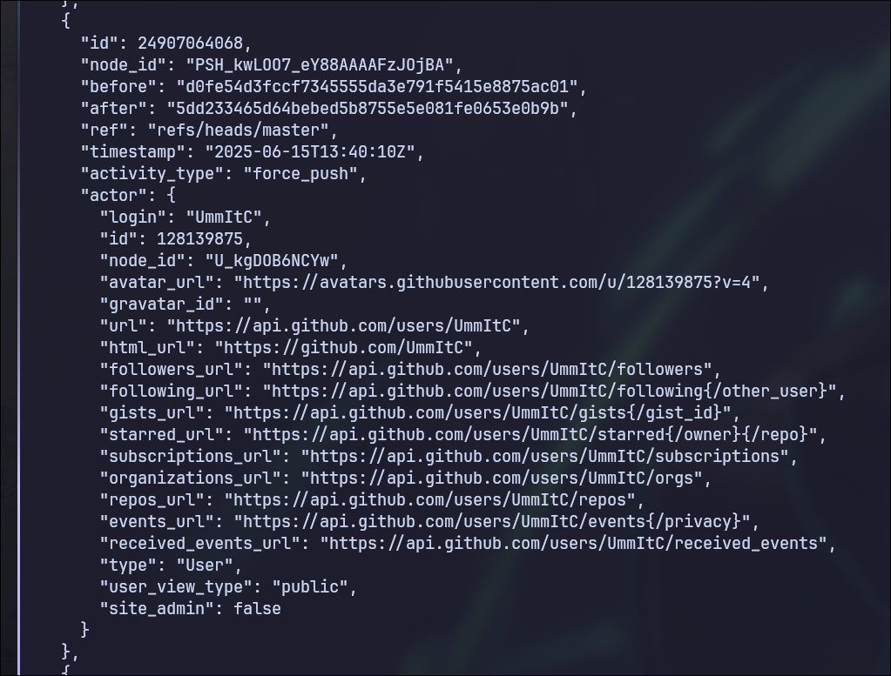

This confirms what I designed—someone tried to hide something using force pushes. For each force push activity, you should copy the commit hash and use GitHub's tree view to examine that specific point in history:

```
https://github.com/UmmItC/NHNC-gitgit/tree/5dd233465d64bebed5b8755e5e081fe0653e0b9b
```

By navigating through the historical versions, you will find the one containing the sensitive information. Checking the `src/app/page.tsx` file in the historical commit reveals the flag:


And there it is! The flag: `NHNC{Don7_tH!NK_foRCe_PU$H3d_CAn_HElp_YoU_hiD3_mE$s@6e!!!!-_0}`

### Key Takeaway

This challenge demonstrates an important security principle: **force pushing doesn't actually delete commit history from GitHub's servers**. The commits remain accessible through the API and can be discovered by anyone who knows where to look.

In real-world scenarios, if sensitive information is accidentally committed, the proper remediation involves:

```
Just Delete the repository and Push again.

Force push won't help you hidden. If that guy want to fuck you.
```

---

## Crackme Challenge

### Challenge Overview

This challenge involves Linux/Arch Linux and digital forensics. You are provided with a qcow2 virtual machine file that's been compressed into a tar.xz archive.

### Initial Setup

First, you should extract the archive:

```shell
tar -xfv crackme.tar.xz
```

Then boot the virtual machine using QEMU:

```shell
qemu-system-x86_64 \
  -enable-kvm \
  -machine q35 \
  -m 3024 \
  -smp sockets=1,cores=2,threads=2 \
  -cpu host \
  -drive file=crackme.qcow2,if=virtio,format=qcow2,discard=unmap \
  -device virtio-scsi-pci \
  -netdev user,id=net0 \
  -device virtio-net-pci,netdev=net0 \
  -vga qxl \
  -boot c
```

Alternatively, you can import it using virt-manager if you prefer a GUI approach.

### Password Reset

When you boot the virtual machine, you'll discover it's running Arch Linux. However, there's a problem: **you don't have the password to log in**.

### GRUB Boot Parameter Modification

You need to bypass the login requirement using GRUB. You should reboot the machine and when the GRUB menu appears, press `e` to edit the boot entry.

You should navigate to the line that loads the Linux kernel image:


At the end of the Linux kernel line, you need to add: `init=/bin/bash`


Then press `Ctrl+X` to boot with the modified parameters.

This boot parameter tells the system to load bash directly after the kernel loads, giving you root access without requiring a password.

Now you can reset the password:

```bash
passwd
```

You can set any password you want (for example, `123`).

After that, force a reboot to apply the changes:

```bash
reboot -f
```

Finally, you can log in with the password you just set.

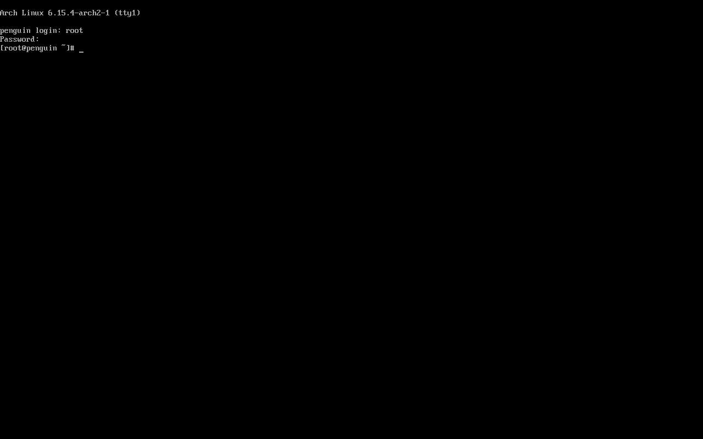

### Analysis File

But we're not done yet! You should take a look at the files first with `ls -la`. You'll notice a file called `.photorec.sig` and `README.md`.

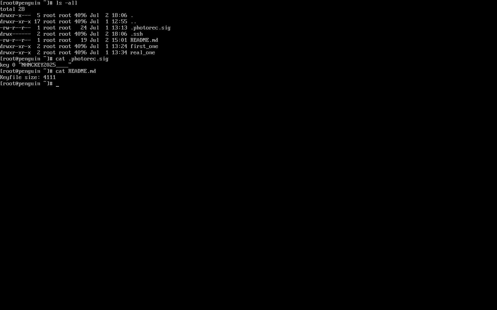

If you don't know what photorec is, a quick search will show you it's a file recovery tool, and it's also related to the README.md message.

Now we can do a simple check of the machine with `cat /etc/fstab` and `lsblk`.

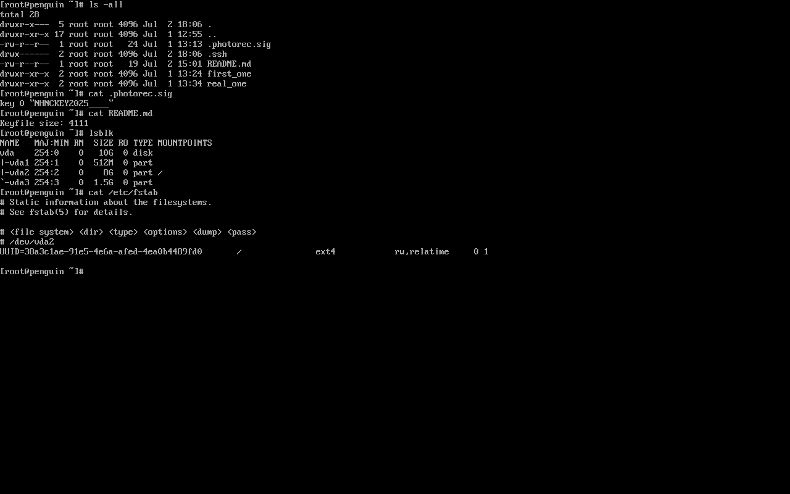

It looks like only one partition is loaded, but you'll notice that `lsblk` shows a partition that's about `1.5G`.

Seems like you need something to open it. You should try using `cryptsetup isLuks` to check if this is a LUKS partition that needs to be decrypted:

```shell
cryptsetup isLuks -v /dev/vda3
```

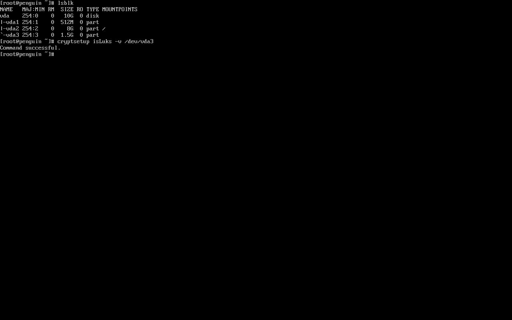

Yes! This is a LUKS partition. 

Now we can confirm the information in README.md and the `photorec` file are definitely related. You should try recovery by starting to install the `testdisk` package and using `photorec` to do the recovery.

According to the information you have, you can set the file to only recover `.key` files with this custom signature: `key 0 NHNCKEY2025____`. Now run `photorec` and process the first disk `/dev/vda`.


Now you should use `File Opt`. By default, photorec uses all extensions, but based on the information you have, you only need to use custom signatures.


You should select only `custom Own custom signatures` by pressing `s` to disable all, then pressing `space` to select `custom Own custom signatures`. Save the option by pressing `b`.


Go back to the menu by pressing `q`.

Now you can start searching for deleted files by pressing search and selecting `[Whole disk]`.

This will ask about the format of the partition. As you can see in `/etc/fstab`, you know it's `ext4` format. You should select the ext4 format.


Now you should select the directory where you want to save the recovered files. Just select `.` and press `C` to continue.


You'll see a few custom files being recovered. Let you check these files. Quit the program by pressing `q` multiple times.

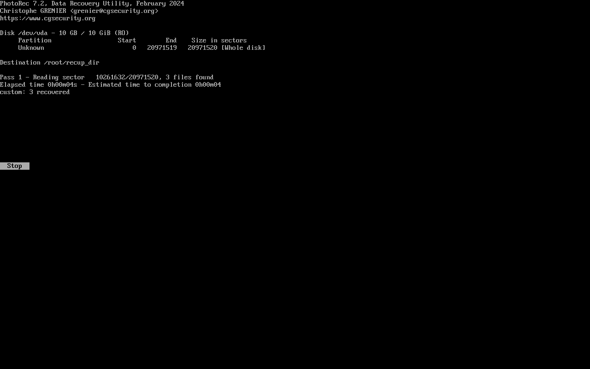

You'll find five files here. Let's confirm if these are the NHNC keys you need by checking the header with this command:

```shell
hexdump -C f11421696.key | head

0000000 4e 48 4e 43 4b 45 59 32 30 32 35 5f 5f 5f 5f 5c |NHNCKEY2025____\|
....
```

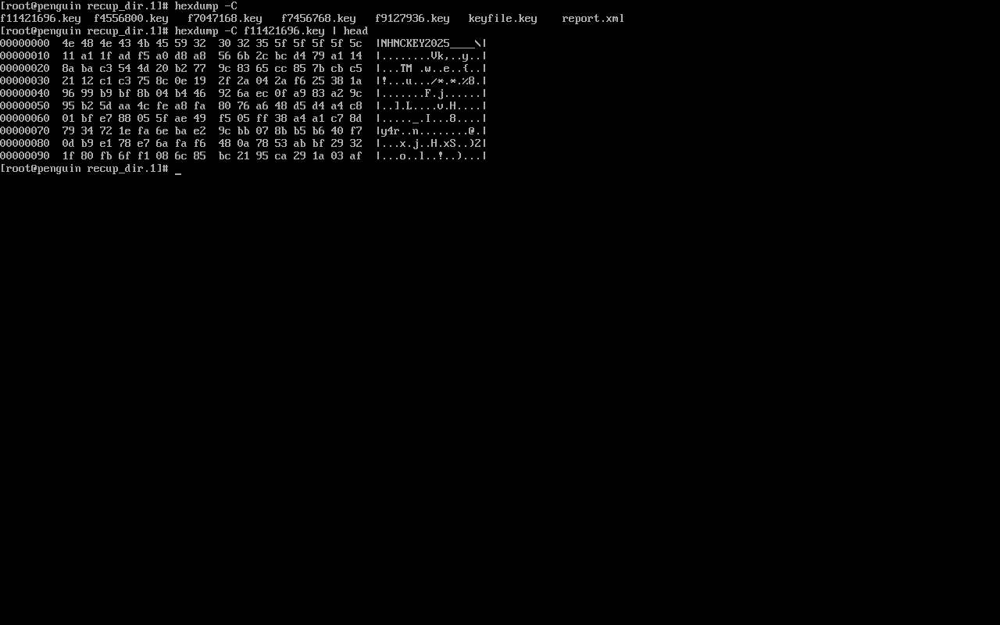

Perfect! The first one you can see contains `NHNCKEY2025____`, which matches the `.photorec.sig` signature. This is likely the keyfile you need. However, there's one problem - the file is too big and oversized.

Looking back at the README.md message, you can see it says the keyfile size is `4111`!

So now you can trim the file to the correct size:

```shell
head -c 4111 f111421696.key > keyfile.key
```


Now, let's try to decrypt `/dev/vda3` with this keyfile and mount it:

```shell
cryptsetup -v open /dev/vda3 NHNCluks --key-file keyfile.key
cd ~ && mount /dev/mapper/NHNCluks first_one
```

> By the way, you can see there are already two empty directories - that's actually a hint that you need to mount two partitions to capture the flag.


Now let's see what files are in the first_one directory:

```shell
cd first_one
ls -la
```

You'll have a `wordlist.txt` file and `secret.img`. At this point, the usage is pretty clear, right? So first, test if this is a LUKS image:

```shell
cryptsetup -v isLuks secret.img
```


Yes! The command confirms this is a LUKS image. Now you just need to use the wordlist to bruteforce this image to find the password.

> Also, the keyfiles were taking up too much space. You should delete all the unused key files from the directory since they're taking up a lot of filesystem space and might affect your ability to download things.

You can use a tool from the Kali repository called `bruteforce-luks`:

> https://www.kali.org/tools/bruteforce-luks/

But there's one problem - this machine isn't Kali, right?

You can find the source code and build the program yourself. Actually, thinking about this question also coincides with me creating my very own first GNU/Linux distro based on Arch. (been a while xd)

As a CTF player and Arch user, I also started packaging my own packages, and surprisingly, this bruteforce tool doesn't even exist in AUR.

So to sum it up, you have several choices for how to bruteforce the `secret.img`:

1. Build the source code from https://github.com/glv2/bruteforce-luks
2. Use my package and just run `makepkg -si` to finish the build (https://github.com/UmmItOS/packages.git)
3. Write your own script to bruteforce

The easy way is using my PKGBUILD to install bruteforce-luks.

First, you should install git:

```shell
pacman -Sy
pacman -S git
```

But here's one problem: PKGBUILD doesn't allow using root for building, so you should create a temporary user just for this case to install the PKGBUILD package:

```shell
useradd -m nhncuser
passwd nhncuser
```

Now give permissions to this new user for sudo:

```shell
usermod -aG wheel,storage,power nhncuser
```

With visudo:

```shell
EDITOR=vim visudo

# Uncomment `%wheel ALL(ALL:ALL) ALL`
```

Now switch to the new user:

```shell
su nhncuser
```

And go back to the user's home directory:

```shell
cd ~
```

Now clone my repository:

```shell
git clone https://github.com/UmmItOS/packages.git
cd packages/pen-packages/bruteforce-luks
makepkg -si
```

After installing bruteforce-luks, you should go back to the root user to run the bruteforce:

```shell
exit
cd first_one
bruteforce-luks -v 5 -f wordlist.txt -t 5 secret.img
```

The time this takes depends on how much CPU you're using! 

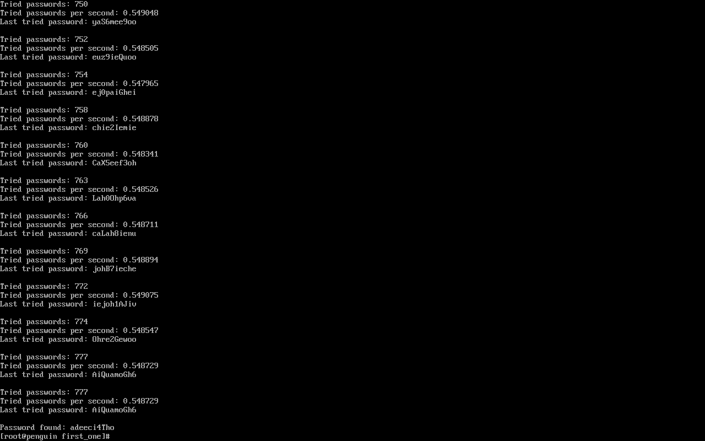

It will take some time. ( 2 threads about 30min~

I set the password to be around line 777 in the wordlist. Since didn't want people guessing the password easily XD, so maybe I made it a bit challenging...

Finally, you'll get the password: `adeeci4Tho`.

Let's use this password to decrypt the LUKS image and mount it:

```shell
cryptsetup open secret.img luksimg
mount /dev/mapper/luksimg real_one/
```

And now you can see the flag:

```shell
cat real_one/flag.txt
```

The flag is: `NHNC{USiNG_PhoTOReC_@S_@_8ACKup_1s_a_90OD_!DE4,_but_KeeP_!n_M!nD_TH47_Lo$iN9_TH3_Key_W!lL_c4uSE_Pro8leM5.______0x0__got_it?}`

There are many ways to copy the flag - you can use online upload services, APIs, download/copy servers, etc. One nice file sharing service I use often is `0x0.st`.

Or you can set up this machine to be accessible via SSH to login and copy the flag from the terminal.

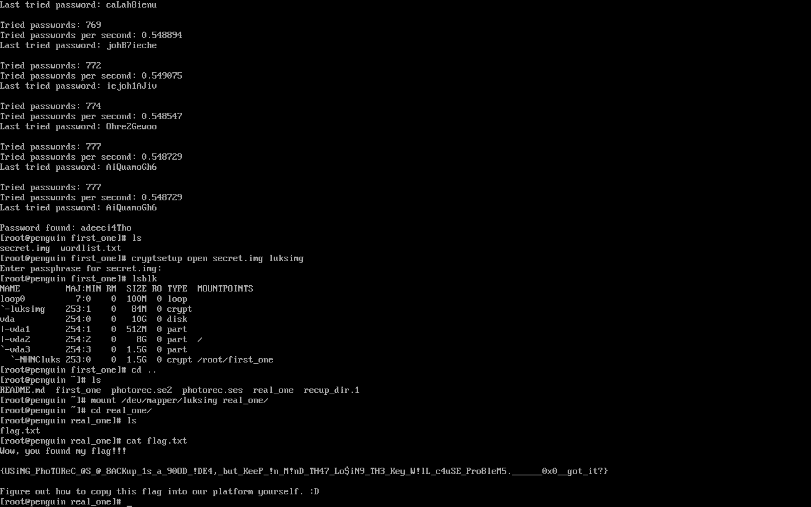

## Final Thoughts

That's all for my challenges! Thanks everyone for playing my questions! :D

Hopefully you learned something or found it fun and helpful.

Did you learn a lot about recovery, Linux, and GitHub/Git usage? :D

29 Teams solve my gitgit

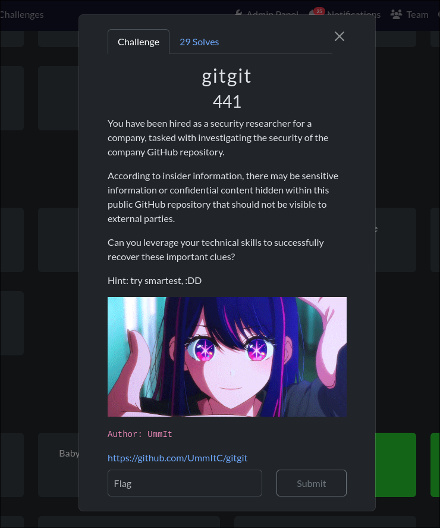

3 Teams solve my Crackme

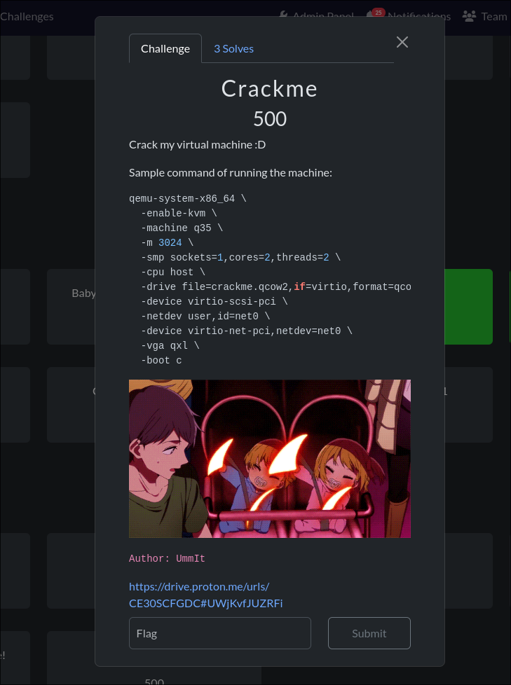