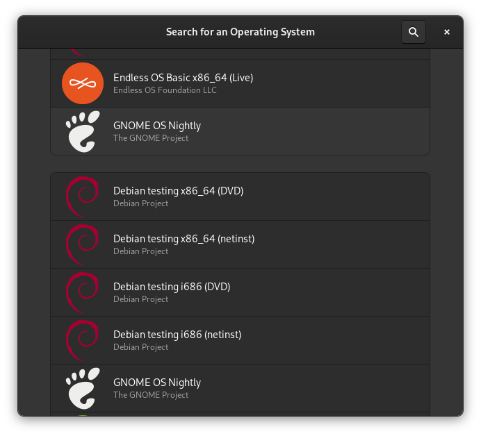
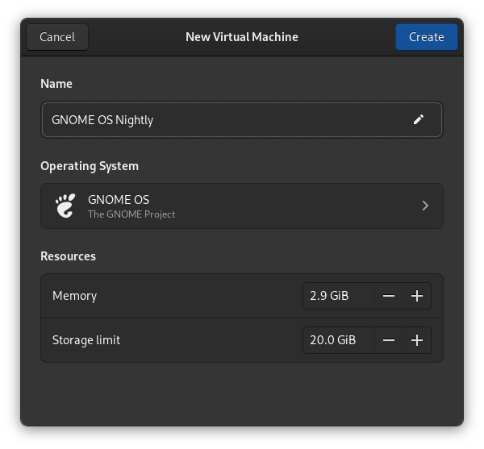
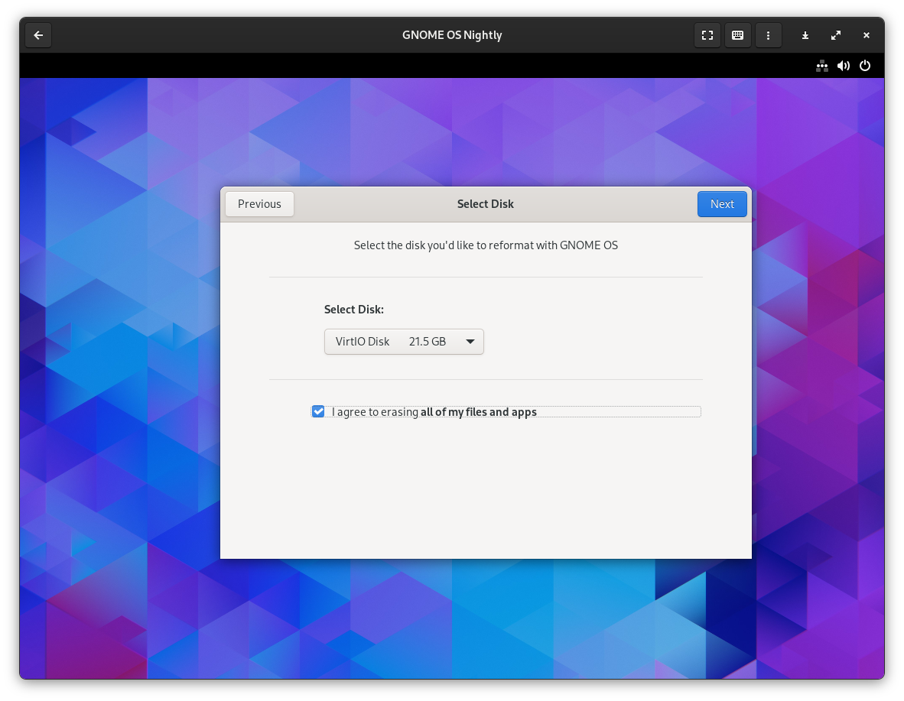
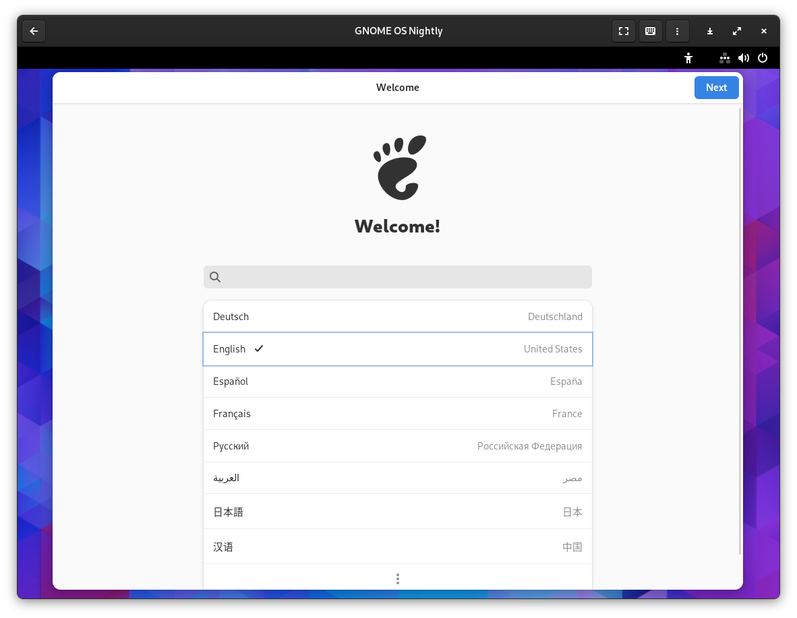
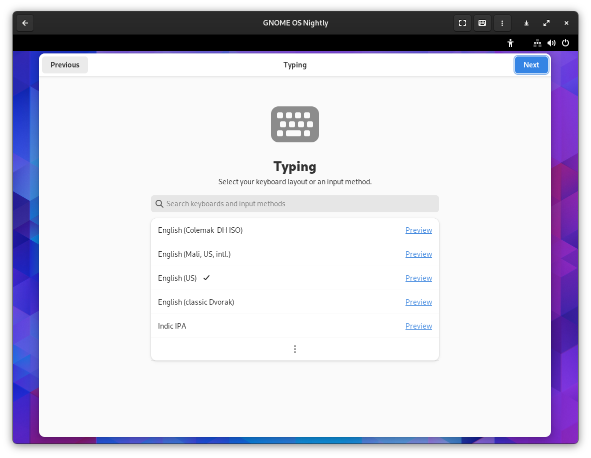
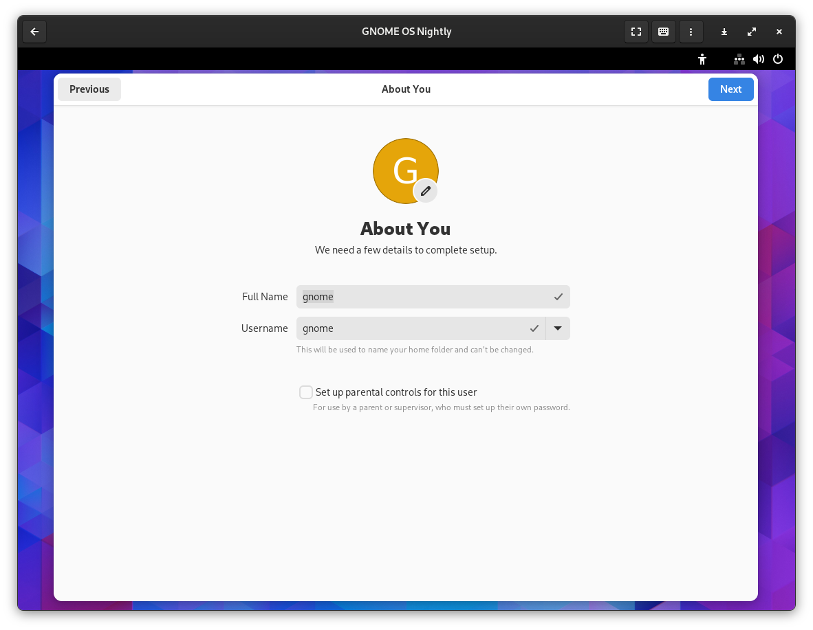
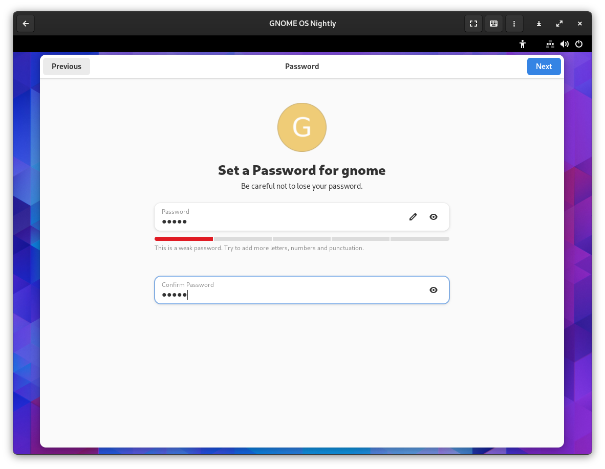

## Why this article?

As a gnome Linux user, not long ago, gnome released version 45, which you can try on gnome os. This gave me the idea of ​​writing this article. Plus I haven’t tried gnome os yet,

In addition, although the Arch is a rolling release, gnome 45 has not been officially released yet, so I would like to take this opportunity to try gnome os!

## Introduction

For those passionate about the GNOME desktop environment and eager to get a taste of the freshest developments, GNOMEOS is the perfect solution. In this blog post, we'll explore GNOMEOS and its key features, emphasizing its role as a platform to experience the cutting-edge of GNOME software.

### 1. GNOMEOS: A Peek into the Future of GNOME

GNOMEOS allows you to step into the future of GNOME software by offering a chance to try the latest and greatest features and applications. If you're a dedicated GNOME user or developer, this is your golden ticket to see what's coming next.

### 2. Pre-release Software Disclaimer

It's essential to note that GNOMEOS is pre-release software. While it's a fantastic opportunity to explore upcoming GNOME features, it comes with a disclaimer: "Bad things may happen if you use it in production." This means it's not intended for everyday, production use. Instead, it's designed for testing, experimentation, and development purposes.

### 3. Real Hardware or Flathub Boxes

To get the most out of GNOMEOS, you have two primary options: real hardware or virtual machines. Running GNOMEOS on real hardware allows you to experience it in a native environment, but if you prefer a virtualized setup, GNOME Boxes is a convenient choice.

### 4. Installation with Ease in GNOME Boxes

For those opting for the virtualized experience, GNOMEOS can be easily installed using GNOME Boxes. You can select and install GNOMEOS directly from GNOME Boxes, making the setup process straightforward. This simplified approach ensures a hassle-free installation for your exploration of GNOMEOS.

## How to Install GNOME OS

Installing GNOME OS is a straightforward process, whether you're using real hardware or a virtual machine (VM). In this guide, we'll walk you through the steps to get GNOME OS up and running on your system.

### Prerequisites

Before you begin, make sure you have the following:

- A computer or VM with sufficient resources to run GNOME OS.
- [GNOME Boxes](https://wiki.gnome.org/Apps/Boxes) installed (for VM installation).

### Installation Steps

In this example, we'll use GNOME Boxes for Virtual Machine. And you have two options for obtaining the GNOME OS ISO:

- **Download from the Official Website**: Visit the [official GNOME OS website](https://os.gnome.org/) to download the ISO image.

- **Download from Boxes**: Alternatively, if you're using GNOME Boxes, you can download the ISO directly from within the application.

Now, let's proceed with the installation process using the ISO you've obtained.

**1. Open GNOME Boxes**

Launch GNOME Boxes on your system. You can find it in your application menu or search for it.

**2. Create a New Virtual Machine**

Click on the "New" button to create a new virtual machine. You have two installation options: "Install from file" or "Download OS from Boxes." Choose the one that suits your preference.

**3. Select GNOME OS**

If you opt to download GNOME OS from Boxes, you can select it from the list of available operating systems.

**3.2 Download from Boxes**

Wait for the Boxes download finish. Then goto next step. that will take some times.

**4. Configure VM Specifications**

Specify your virtual machine's specifications, including the amount of RAM, CPU cores, and storage. Adjust these settings according to your system's capabilities.

**5. Power On Your VM**

Once you've configured the VM, click the "Create" button. Then, power on your VM by selecting it and clicking the "Start" button.

**6. Begin the Installation**

After powering on your VM, you'll see a window prompting you to install GNOME OS. By default, it will contain the latest version of GNOME.

**7. Reformat and Install**

Click "I agree to erasing all of my files and apps" to begin the installation process. This step will erase any existing data on the VM.

**8. Wait for Installation to Complete**

The installation process may take some time. Wait until it finishes.

**9. Complete the Setup**

Once the installation is complete, power off your GNOME OS VM and then power it on again.

**10. Initial Configuration**

Follow the on-screen prompts to set up your GNOME OS. This includes selecting your language, typing method, location services, time zone, personal information, and password.

**11. GNOME OS is Ready**

Congratulations! GNOME OS is now installed and ready to use on your virtual machine or real hardware.

### Exploring the Latest GNOME OS

Once you've completed the installation and initial configuration, you can explore the latest GNOME OS.  

>For GNOME 45 You'll notice changes, including a more detailed about page for GNOME. That was really cool, i love that!

Now you can enjoy and experiment with the latest GNOME features and improvements on GNOME OS. Have fun exploring!

## Conclusion

GNOMEOS is your bridge to the future of the GNOME desktop environment. It provides a platform for enthusiasts and developers to try out upcoming GNOME features, but it's important to remember that it's not suitable for production use. Whether you prefer real hardware or the convenience of Flathub Boxes, GNOMEOS offers a glimpse into what's next in the world of GNOME software.

So, if you're excited about the latest in GNOME and eager to contribute to its development or simply explore the cutting-edge features, GNOMEOS is your gateway to a world of innovation and possibilities. Just remember to use it wisely, respecting its pre-release nature and the potential for unexpected issues. Happy GNOME exploring!
