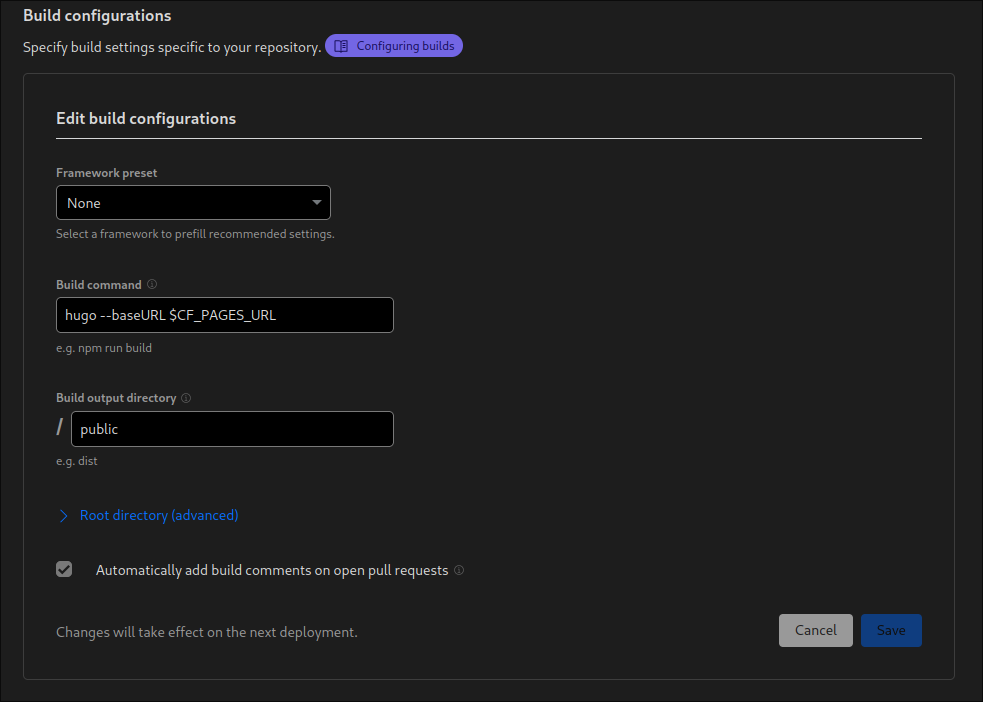

## Introduction

When mirroring your Hugo site with GitLab and Cloudflare, ensuring that the site is fully functional is crucial. The build process depends on the `baseURL` configuration in your Hugo `config.yaml`. To make this work seamlessly, you need to adjust the build command for both GitLab Pages and Cloudflare Pages. This guide walks you through the process.

## Cloudflare Pages

Cloudflare Pages automatically follows your GitLab or GitHub repository. Here are the steps to set it up:

### Step 1: Adding Environment (Optional)

To manage your domain effectively, consider adding an environment variable:

1. Navigate to Worker & Pages -> Settings -> Environment variables.
2. Add the variable: 
   - Variable name: `CF_PAGES_URL`
   - Value: Your Cloudflare Pages domain.

### Step 2: Build Command

Adjust the build command to include the `baseURL` when building the Hugo site:

1. Navigate to Builds & Deployments -> Build Configurations -> Edit Configurations.
2. Update the Build command:
   ```shell
   hugo --baseURL $CF_PAGES_URL
   ```
   

## GitLab Pages

For GitLab Pages, you can use CI/CD GitLab Actions. Here is an example of a GitLab CI configuration for Hugo:

```yaml
default:
  image: "${CI_TEMPLATE_REGISTRY_HOST}/pages/hugo:0.121.1"

variables:
  GIT_SUBMODULE_STRATEGY: recursive
  GL_PAGES_URL: domain.com
  
pages:
  script:
    - hugo -b $GL_PAGES_URL
  artifacts:
    paths:
      - public
  rules:
    - if: $CI_COMMIT_BRANCH == $CI_DEFAULT_BRANCH
  environment: production
```

This configuration ensures that the `baseURL` is correctly set during the Hugo build process for GitLab Pages.

## GitHub

Coming soon ...

```yaml
git:
 depth: false

env:
 global:
 - HUGO_VERSION="0.121.1"
 matrix:
 - YOUR_ENCRYPTED_VARIABLE

install:
 - wget -q https://github.com/gohugoio/hugo/releases/download/v${HUGO_VERSION}/hugo_${HUGO_VERSION}_Linux-64bit.tar.gz
 - tar xf hugo_${HUGO_VERSION}_Linux-64bit.tar.gz
 - mv hugo ~/bin/

script:
 - hugo -b $GH_PAGES_URL

deploy:
 provider: pages
 skip-cleanup: true
 github-token: $GITHUB_TOKEN
 keep-history: true
 local-dir: public
 repo: gh-username/gh-username.github.io
 target-branch: master
 verbose: true
 on:
 branch: master
```

## Conclusion

By following these steps for both Cloudflare Pages and GitLab Pages, you ensure that your Hugo site is mirrored and built correctly with the specified `baseURL`, resulting in a fully functional and mirrored website.

## References

- [CI/CD YAML syntax reference](https://docs.gitlab.com/ee/ci/yaml/#variables)
- [How to Set Variables In Your GitLab CI Pipelines](https://www.howtogeek.com/devops/how-to-set-variables-in-your-gitlab-ci-pipelines/)
- [Define a CI/CD variable in the .gitlab-ci.yml file](https://docs.gitlab.com/ee/ci/variables/#define-a-cicd-variable-in-the-gitlab-ciyml-file)
- [Deploy with Cloudflare Pages](https://developers.cloudflare.com/pages/framework-guides/deploy-a-hugo-site/#deploy-with-cloudflare-pages)
