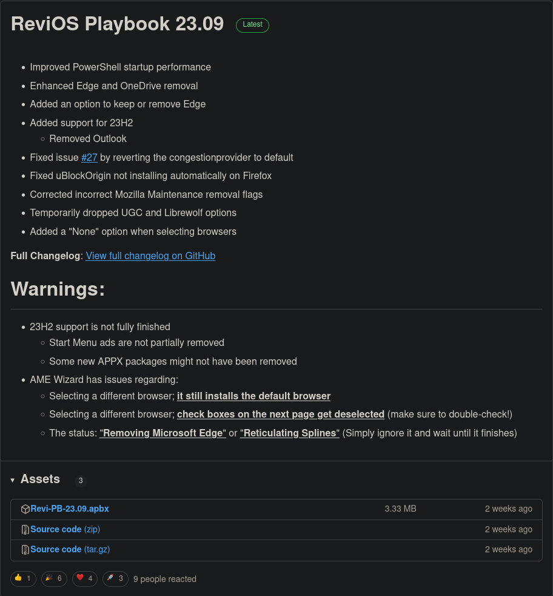
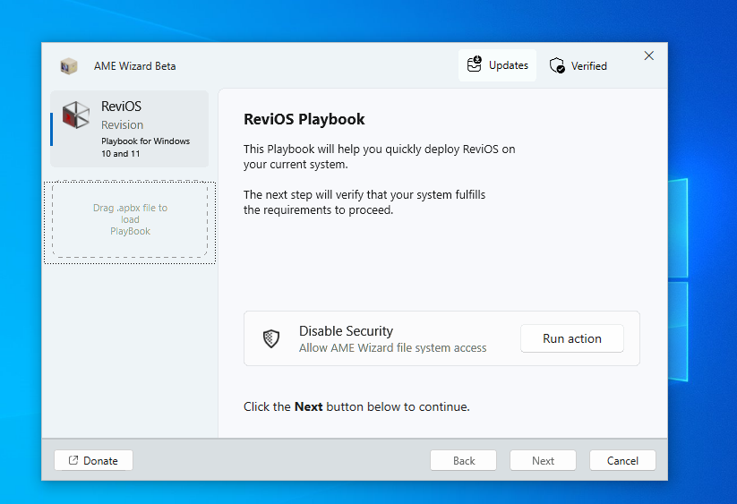
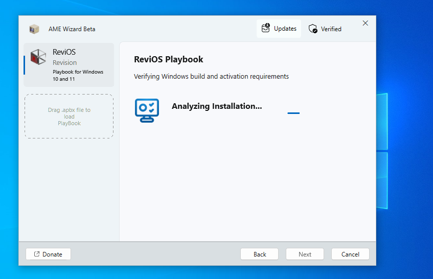
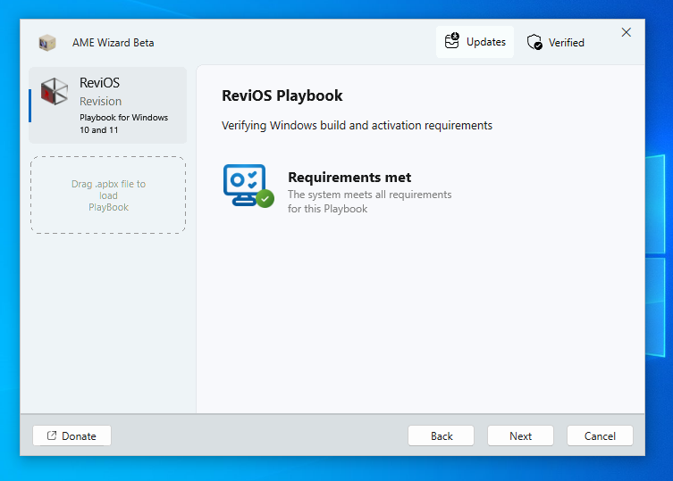
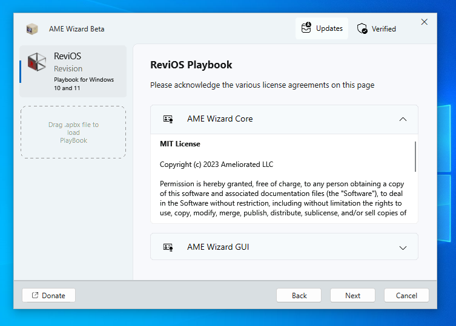
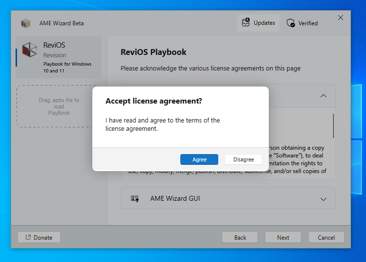
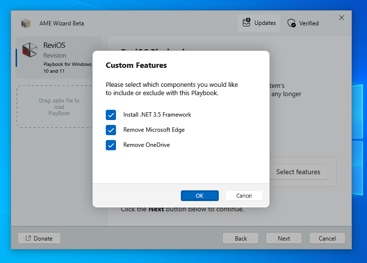
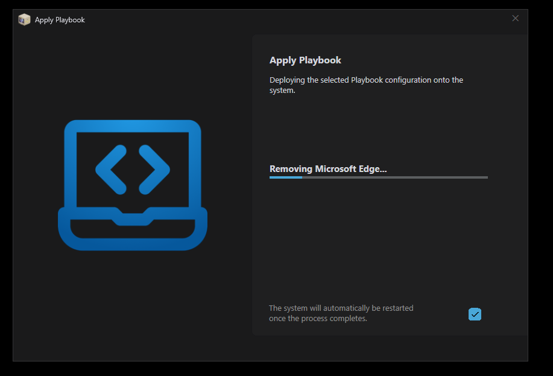
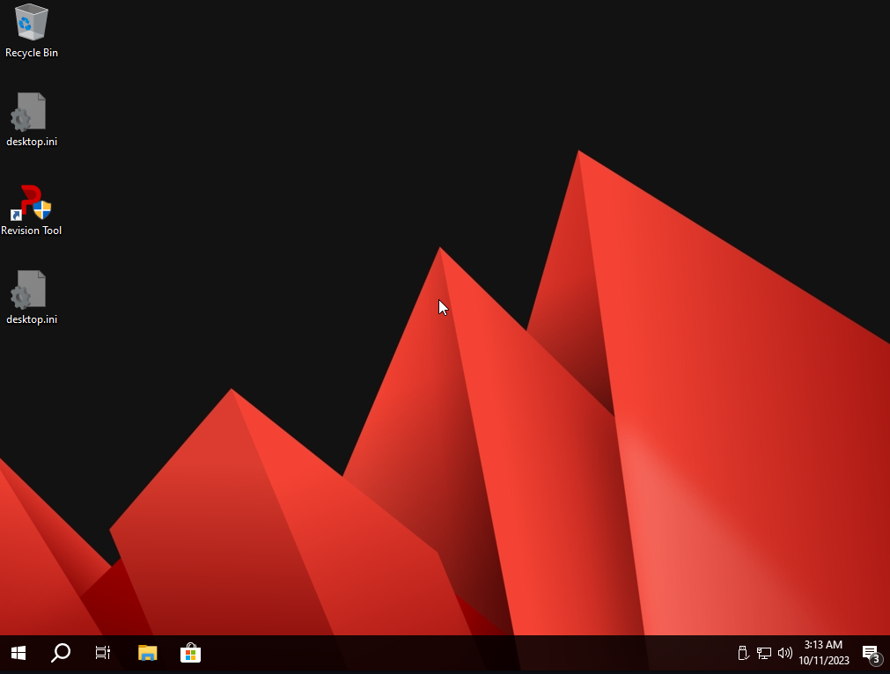

## Introduction

Windows operating systems often come with a lot of pre-installed software, which can significantly slow down your computer's performance. Despite attempting to remove them, these unwanted programs tend to reappear after a while. This is a common issue faced by many Windows users. However, there is a solution: ReviOS.

### How Can ReviOS Help?

In this article, I will introduce you to ReviOS, a program designed specifically for Windows 10/11 to strip down unnecessary elements from your installation, including applications like EDGE and Internet Explorer. By removing these programs, ReviOS can potentially double your Windows system’s speed. It achieves this by eliminating up to 70 built-in applications that often slow down your Windows 10/11 computer.

### What Exactly is ReviOS?

[ReviOS](https://revi.cc/) is an open-source software maintained by the community. Its primary goal is to create a customized version of Windows that offers improved performance. While Windows 10/11 doesn't inherently require powerful hardware, the presence of unnecessary built-in software can demand more resources, affecting your system's speed. ReviOS aims to address this issue.

### Pre-Installation Steps

Before installing ReviOS, it's crucial to follow these steps:

1. Ensure you have a fresh Windows installation.
2. Update your new Windows installation.
3. Install ReviOS after completing the updates.

Now, let's proceed with the installation process.

## Step 1: Download Required Files

Visit the [ReviOS website](https://revi.cc/revios/download) and download two essential software:

1. **AME Wizard**: Click the download button on the [AME Wizard page](https://ameliorated.io/).
   
   

2. **ReviOS Playbook**: Download the `apbx` file from the [ReviOS Playbook GitHub release page](https://github.com/meetrevision/playbook/releases).
   
   

AME Wizard acts as an injector, allowing you to modify your Windows system. ReviOS is the program you'll inject into it. Now, let's move on to the installation steps.

## Step 2: Launch the AME Wizard

Start the AME Wizard program. You might need administrative permissions, so click "Yes" when prompted.

> **Note**: Windows Defender might flag this program as harmful, leading to its closure. To proceed, disable all antivirus settings. You will also be asked to close the antivirus during the next step. Whether you do it now or later doesn't matter; just ensure it's closed before continuing.

   

## Step 3: Inject ReviOS Playbook into AME Wizard

Drag and drop the downloaded `apbx` file into AME Wizard and click "Next."

   

## Step 4: Disable Windows Security

As mentioned earlier, turn off all Windows security settings. Click "Next" once all security options turn gray.

   

## Step 5: Verify Windows Build Requirements

Wait for the playbook to validate your Windows version.

   

After validation, if the program confirms that your system meets the playbook's requirements, click "Next."

   

## Step 6: Accept the License Agreement

Read the license agreement on this page. click "Next."

   

Click "Agree."

   

## Step 7: Customize Features (Optional)

ReviOS offers several customization features in this step. If you don't wish to customize, simply click "Next." However, let's explore the options. Click "Select Features."

   

The first feature allows you to choose your preferred browser.

   

Select the components you want to install or remove. It's recommended to select all components. Once done, click "OK."

   

After confirming your choices, click "Next."

   

## Step 8: Apply Changes

Wait for the playbook to complete the process. The option to automatically restart the system is selected by default. If you don't choose this option, restart manually after the process finishes.

> **Note**: Do not perform any actions until the process completes. Be patient in case of any unexpected issues.

   
   
   

## Step 9: Completion

After restarting your system, you'll notice the changes, including the new wallpaper!

   

### Process Optimization

Check Task Manager to observe the reduced number of running processes. ReviOS dramatically reduces the count; originally, there could be up to 130 processes. The reduction ratio is approximately 2.28, meaning the program has halved the number of processes.

   

### Revision Tool

After installing ReviOS, you'll find a program called Revision Tool. This tool allows further customization, such as enabling updates and Windows Defender. These settings are entirely up to you.

   
   
   

## Is ReviOS Recommended?

I have previously used AtlasOS, but it didn't work well for me. The main issue was its complete removal of the Windows update function. Some Windows programs require updates for proper installation. ReviOS, however, allows you to enable updates instead of removing the function entirely.

Overall though, I think ReviOS is the most balanced, you don't need to customize it too much because the default installation is already what most people want. Just like out of the box
