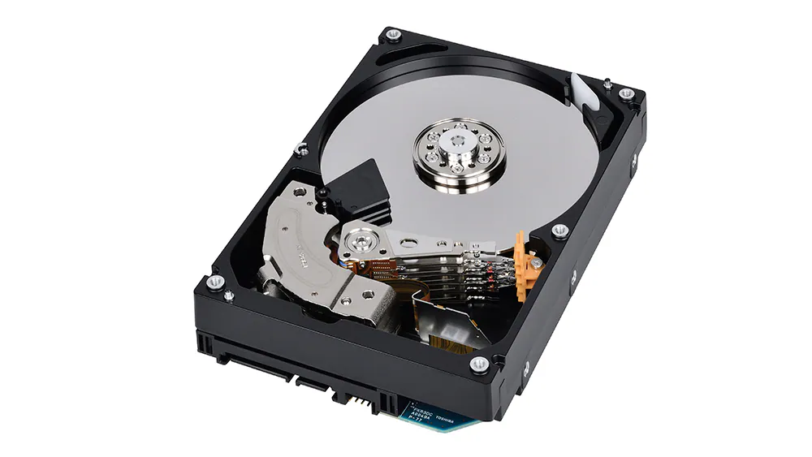

## Introduction

I recently decided to upgrade my computer by adding a new HDD. This was a significant step for me as I hadn't worked much with hardware before and hadn't installed any HDD in my computer.

>`("Toshiba Enterprise Series MG08ADA400N 4TB 7200rpm 256MB 3.5")`



## Why Upgrade?

Initially, I hesitated due to concerns about storage space, but with the increasing number of virtual machines on my computer, especially after the GPU passthrough, I finally decided to invest in a new HDD. Today, I purchased a 4TB HDD, and I'm excited to share my experience of installing hardware for the first time.

## How to Install the HDD: A Beginner's Guide

Having watched several YouTube videos that weren't beginner-friendly, I sought advice from the online community. The entire process took around 5 hours, and I learned valuable lessons on how to install an HDD.

### Step 1: Get Ready

Remove the left and right side plates from the computer case. Identify the HDD socket on the motherboard, the motherboard SATA socket, and the power supply unit socket.


### Step 2: Find the Cables

You'll need two cables for the installation—usually found in the motherboard and power supply boxes.

#### Power Supply Unit Cable

This cable supplies power to the HDD.


#### SATA Cable

This cable is for data transfer.


### Step 3: Plug in the Cables

Ensure the power supply unit and SATA cables are plugged in correctly. Connect the power supply unit cable to the corresponding port on your PSU, and connect the SATA cable to one of the SATA 3-5 ports on the motherboard.


### Step 4: Test the HDD

Reconnect all cables (PSU, HDMI, USB, keyboard, etc.), turn on your computer, and check if the HDD is correctly displayed using the `lsblk` command in the terminal.

```shell
❯ lsblk
NAME           MAJ:MIN RM   SIZE RO TYPE  MOUNTPOINTS
sda              8:0    0   3.6T  0 disk <- This is my new HDD
```

### Step 5: Secure the HDD

Ensure the HDD is correctly placed in the rack inside the computer case. Lock the HDD rack securely.

## Conclusion

This beginner's guide aims to simplify the process of installing an HDD for those, like me, who are new to hardware upgrades. With your new HDD successfully installed, you'll have expanded storage and improved capabilities for your computer.

## Reference

- [What Does a SATA Port Look Like?](https://pcguide101.com/motherboard/what-does-a-sata-port-look-like/)
