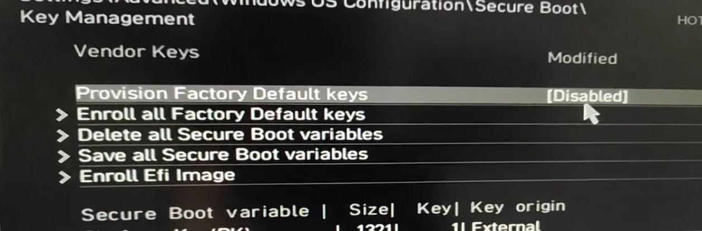

## Introduction

For a Linux user pursuing a secure system, it is imperative to enable Secure Boot. Nonetheless, merely turning it on does not guarantee a smooth boot. Signing a key on the Linux device is necessary to attain this. Failing to complete this important step will cease access to the Linux system. In this guide, I will lead you through the key signing process on your Linux machine. This essential step guarantees a smooth start-up for your Linux system and takes your Linux device to the next level of security.

## Preparation

Before signing a key in the BIOS, there are some necessary steps you must do.

### 1. CSM Support

The options to disable and enable Secure Boot are only available when your CSM options are disabled. Therefore, the Secure Boot options will be hidden. So just makesure this CSM Options is disabled.

>Note: The CSM options are a feature that allows your system to load up legacy BIOS.

As our system always utilizes UEFI, it is time to bid farewell to the legacy BIOS. Simply disable it.


### Secure Boot Mode

Now, navigate to the Secure Boot mode and modify the setting from Standard to Custom. Just make sure this is on a Setup mode. (Custom)


### Delete Existing keys

Now you have to delete all the existing keys with this setting. Some BIOS systems allow for a simple one-click reset of all the keys.


### Factory Default keys

The factory default keys are no longer required and should therefore be disabled as we will be using our own key for the sign key.



Now, Save the changes and Boot-up your system.

##  What is  `sbctl`?

Sbctl is intended to be a user-friendly secure boot key manager that can set up secure boot, provide key management capabilities, and track files that need to be signed in the boot chain.

The program is coded completely in Golang, with go-uefi for the API layer, and does not depend on existing secure boot tooling.

### Install `sbctl`

Install it now using your package manager:

```shell
sudo pacman -S sbctl
```

### 1. Create Keys

Generate new Secure Boot keys using the following command:

```shell
sudo sbctl create-keys
```

### 2. Enroll Keys

Enroll the newly created keys into the Secure Boot settings:

```shell
sudo sbctl enroll-keys
```

### 3. Sign EFI Images

Identify EFI images that need signing (e.g., `BOOTX64.EFI`, `systemd-bootx64.efi`, `vmlinuz-linux`). Sign each image using `sbctl sign`:

```shell
sudo sbctl sign -s /boot/EFI/BOOT/BOOTX64.EFI
sudo sbctl sign -s /boot/EFI/systemd/systemd-bootx64.efi
sudo sbctl sign -s /boot/vmlinuz-linux
```

### 4. Verify Signed Keys

Use this command to verify that the keys were successfully signed or that existing keys are available on your system:

```shell
sudo sbctl verify
```

### 5. Enable Secure Boot

Now, Reboot your System and Return to BIOS, enable Secure Boot, and again reboot your system!

## Verification

There are several methods available to confirm if your system has enabled secure boot. Let us explore how to check and ensure system security.

### 1. Using bootctl

As I use the systemd init system, it is always beneficial to utilize bootctl for system initialization. To view the commands, simply enter `bootctl` for an immediate result.

```shell
$ bootctl

System:
      Firmware: UEFI 2.80 (American Megatrends 5.27)
 Firmware Arch: x64
   Secure Boot: enabled (user)
  TPM2 Support: yes
  Boot into FW: supported

Current Boot Loader:
      Product: systemd-boot 254.5-1-arch
     Features: ✓ Boot counting
               ✓ Menu timeout control
               ✓ One-shot menu timeout control
               ✓ Default entry control
               ✓ One-shot entry control
               ✓ Support for XBOOTLDR partition
               ✓ Support for passing random seed to OS
               ✓ Load drop-in drivers
               ✓ Support Type #1 sort-key field
               ✓ Support @saved pseudo-entry
               ✓ Support Type #1 devicetree field
               ✓ Enroll SecureBoot keys
               ✓ Retain SHIM protocols
               ✓ Boot loader sets ESP information
          ESP: /dev/disk/by-partuuid/xxxxxxx-xxxxxxxxxx-xxxxxxxxxxx
         File: └─/EFI/systemd/systemd-bootx64.efi
```

Basically, you can see all the things with this `bootctl` command, you can see the result is `Secure Boot: enabled (user)`, that mean was successful.

### 2. Using sbctl

Also, `sbctl` has a mini function that can display the status of your secure boot.

```shell
$ sbctl status

Installed:          ✓ sbctl is installed
Owner GUID:  xxxxxxxxx-xxxxxxx-xxxxxxxx-xxxx
Setup Mode:     ✓ Disabled
Secure Boot:  ✓ Enabled
Vendor Keys:  microsoft
```

If all the results display `✓`, then it means you are good!

## Conclusion

By following these steps, you've securely enabled Secure Boot with your self-certified keys, allowing your system to boot only trusted software, enhancing its overall security.

## References

- [Reddit: Simple way to set up Secure Boot? ](https://www.reddit.com/r/archlinux/comments/ji0be6/simple_way_to_set_up_secure_boot/)
- [Arch wiki: User:Krin/Secure Boot, full disk encryption, and TPM2 unlocking install](https://wiki.archlinux.org/title/User:Krin/Secure_Boot,_full_disk_encryption,_and_TPM2_unlocking_install)
- [Install Secure Boot on Arch Linux (the easy way)](https://onion.tube/watch?v=yU-SE7QX6WQ)
- [Setting Up Secure Boot on Arch Linux Using sbctl](https://onion.tube/watch?v=R5dUWnSQIuY)
- [Github: sbctl](https://github.com/Foxboron/sbctl)
- [How to Enable Secure Boot in Bios Gigabyte✅](https://onion.tube/watch?v=waCl06Mg02E)
