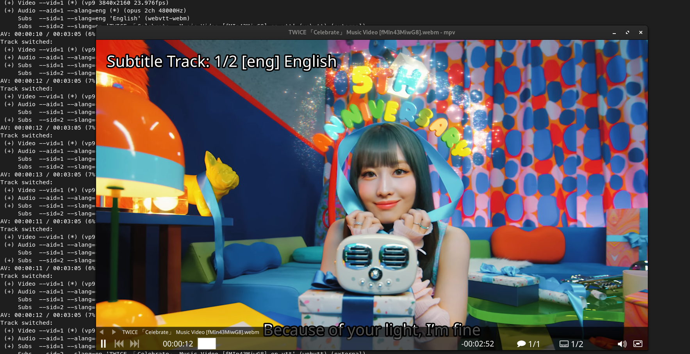
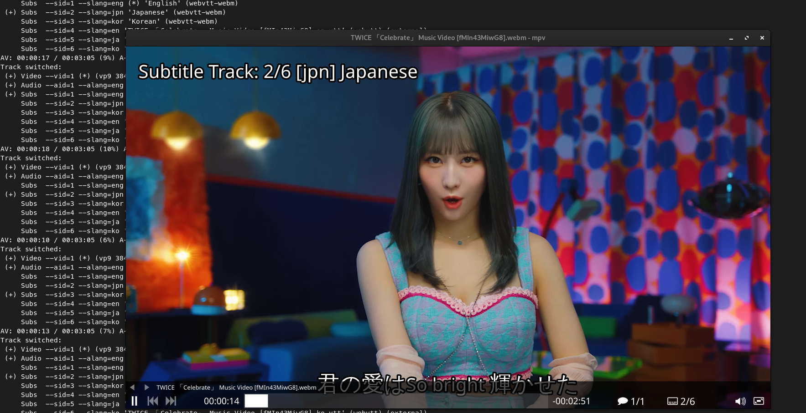

## Introduction

This guide walk you through the command-line tools of yt-dlp, a powerful utility for downloading videos and audio tracks from various streaming platforms. yt-dlp offers a wide range of features, including video format selection, audio extraction, chapter handling, subtitle management, and more.

## Simple and Straightforward Video Download

For a quick and straightforward video download without additional commands, use the following:

```bash
yt-dlp [video URL]
```

## Listing Video Formats

To view available video formats and their details, you can use the following command:

```shell
yt-dlp -F [video URL]
```

This command provides a detailed list of available formats, including resolution, file size, codecs, and more. The output helps you choose the desired format for your download.

### Targeting Specific Format ID

After listing the available formats, you can target a specific format ID to download the video in that format. Higher numbers generally indicate better quality:

```shell
yt-dlp -f 248+251 [video URL]
```

This command selects the video (ID 248) and audio (ID 251) formats, merging them into a single file.

### Targeting Specific Extension Type

If you prefer a specific extension type, such as mp4, you can use:

```shell
yt-dlp -f mp4 [video URL]
```

This command filters the formats to include only those with the mp4 extension, simplifying your download preferences.

## Extracting Audio from a Video

Sometimes, you might only be interested in the audio content of a video, especially for music tracks. to extract the audio from a video, use the following command:

```bash
yt-dlp --extract-format --audio-format mp3 [video URL]
```

This command tells yt-dlp to extract the audio ( `--extract-format` or `-x`) and convert it to the MP3 format (`--audio-format mp3`).

## Batch Downloading with list

Batch downloading can be useful when you want to download multiple videos in one go. You dont need to one-by-one paste to one command. Here's how you can achieve this with yt-dlp:

1. You will need to create a text file containing the URLs of the videos you want to download. Each URL should be on a separate line.
2. Save the text file with a name that is easy to remember, such as `video_list`.
3. Execute the following command to initiate the batch download:

```bash
yt-dlp --batch-file path/to/video_list
```

## Chapter Handling

You can manage chapters in videos with yt-dlp, allowing you to navigate through different sections of a video seamlessly.

### Embed Chapters

The `--embed-chapters` option in yt-dlp empowers you to embed chapter markers directly into the video file itself. And using player like mpv to play the video, you can easily navigate through the chapters.

```shell
yt-dlp --embed-chapters [video URL]
```

### Splitting Videos with Chapter Precision

The `--split-chapters` option in yt-dlp enables you to split videos into chapters, creating distinct files for each chapter. This feature is particularly useful when you want to enjoy specific sections of a video without manual trimming or editing.

```shell
yt-dlp --split-chapters [video URL]
```

## Subtitle Management

yt-dlp offers a range of options for managing subtitles, including downloading specific language subtitles, embedding them into videos.

```bash
yt-dlp --list-subs [video URL]
```

Executing this command provides a detailed list of subtitle formats along with their respective names.

```shell
Language   Name                                Formats
en                                             vtt
ja                                             vtt
ko                                             vtt
af-en      Afrikaans from English              vtt, ttml, srv3, srv2, srv1, json3
ak-en      Akan from English                   vtt, ttml, srv3, srv2, srv1, json3
sq-en      Albanian from English               vtt, ttml, srv3, srv2, srv1, json3
...

[info] Available subtitles for fMIn43MiwG8:
Language Name     Formats
en       English  vtt, ttml, srv3, srv2, srv1, json3
ja       Japanese vtt, ttml, srv3, srv2, srv1, json3
ko       Korean   vtt, ttml, srv3, srv2, srv1, json3
```

It's crucial to note that this is the first of two listings and primarily contains auto-generated subtitles. For the main subtitles, written by humans, refer to the final list. In the given example, only three subtitles (en, ja, ko) were crafted by a human for the video.

### Downloading Language-Specific Subtitles and Embedding Them

Download subtitles in a specific language and embed them into the video with the following command:

```shell
yt-dlp --write-sub --embed-sub --sub-lang en [video URL]
```



### Downloading All Available Subtitles (Excluding Auto-Gen)

This method fetches all non-auto-generated subtitles for the video:

```shell
yt-dlp --write-sub --embed-sub --all-subs [video URL]
```



### Downloading Auto-Gen Subtitles

yt-dlp facilitates the download of auto-generated subtitles as well:

```shell
yt-dlp --write-auto-sub --embed-sub --all-subs [video URL]
```


## Thumbnail Management

With yt-dlp also has a feature for thumbnail, Here are base usege:

>Note: This features require FFMPEG to embed.

```shell
yt-dlp --embed-thumbnail [video URL]
```

## Metadata Management

This option are disable by default, metadata are information data of this video. but if you want you can just adding `--add-metadata` or `--embed-metadata`, For example:

```shell
yt-dlp --add-metadata [video URL]
yt-dlp --embed-metadata [video URL]
```

## Download some only

How about only dowload subtitle or Thumbnail? with yt-dlp you can easily do it with `--skip-download`, For instance:

```shell
yt-dlp --write-thumbnail --skip-downoad [video URL]
```

`--write-*` can be interpreted as a download file. Same to subtitle, if you without `--write-sub` only place `--embed-sub ...` that will only embed the subtitle into video. Not including download subtitle file.

## Lots of videos (like lists/channels)

By default, you dont have worries how differernt with downloading lots of  videos. No need adding any command for this.

```shell
yt-dlp [channel URL]
yt-dlp [playlist URL]
```

## Playlist Management with yt-dlp

This section covers various yt-dlp commands for managing playlists, including downloading specific items, limiting the total number of downloads, and customizing output names.

- `--playlist-start [NUMBER]`: Begin downloading from the specified item number.
- `--playlist-end [NUMBER]`: Conclude downloading at the specified item number.
- `--playlist-items [NUMBER]`: Download specific items from the playlist.
- `--max-downloads [NUMBER]`: Limit the total number of downloads.

These commands provide granular control, enabling you to customize your download preferences for specific items or ranges within a playlist.

### Download a Specific Range of Items

To download a specific range of items, utilize the `--playlist-start` and `--playlist-end` options. For example, to download items from the third to the seventh in the playlist:

```shell
yt-dlp --playlist-start 3 --playlist-end 7 [playlist URL]
```

### Download a Specific Range (Starting Point)

If you only specify the starting point, yt-dlp will download from that point onward:

```shell
yt-dlp --playlist-start 3 [playlist URL]
```

### Download a Specific Range (Ending Point)

Similarly, specifying only the ending point results in downloading from the first item up to the specified point:

```shell
yt-dlp --playlist-end 20 [playlist URL]
```

### Download Specific Items

Replace `[range]` with your desired number format, such as `1-10` or `5,8,12-15`. This option ensures that your downloaded files are numbered according to your preference, making organization and navigation a breeze.

```bash
yt-dlp --playlist-items [range] [playlist URL]
```

### Limit the Total Number of Downloads

To cap the total number of downloads from the playlist, employ the `--max-downloads` option. For instance, to download a maximum of 10 items:

```shell
yt-dlp --max-downloads 10 [playlist URL]
```

## Output Naming Options

yt-dlp offers flexible options for specifying the output names of downloaded videos using the `-o` or `--output` parameter.

### Remove ID (with Format)

By default, the output name includes the YouTube title name and video ID. To exclude the ID, use the following format:

```shell
yt-dlp -o %(title)s.%(ext)s
```

### Output with Your Name

You can customize the output name by specifying your desired name:

```shell
yt-dlp -o "Example" [video URL]
```

This results in the video being named `Example.webm`.

### Output with Your Name + Custom Extensions

If you want a specific format like MP4, you can customize both the name and extension:

>Note: Ensure the specified file extension corresponds to the actual video format. If not, you may need to use ffmpeg to convert the downloaded video.

```shell
yt-dlp -o "Example.mp4" [video URL]
```

### Output with ID Only

If you prefer the output name to include only the video ID:

```shell
yt-dlp --id [video URL]
```

The resulting output name could be something like `C-o8pTi6vd.webm`.

## Proxy Management

You can use a proxy to download videos, which can be useful for accessing videos limited to specific countries. Find a suitable proxy IP from a provider like [VPNOverview](https://vpnoverview.com/privacy/anonymous-browsing/free-proxy-servers/) and use it in yt-dlp:

```shell
yt-dlp --proxy [IP] [video URL]
```

## IP Protocol (v4, v6)

Control whether to use IPv4 or IPv6 with these options:

For IPv4:

```shell
yt-dlp -4 [video URL]
yt-dlp --force-ipv4 [video URL]
```

For IPv6:

```shell
yt-dlp -6 [video URL]
yt-dlp --force-ipv6 [video URL]
```

## Source Client IP

Specify the source client IP with:

```shell
yt-dlp --source-address [IP] [video URL]
```

## Limit Download Speed

Control the download speed to avoid impacting your network. For example, to limit the speed to 100K:

```shell
yt-dlp --throttled-rate 100K [video URL]
```
