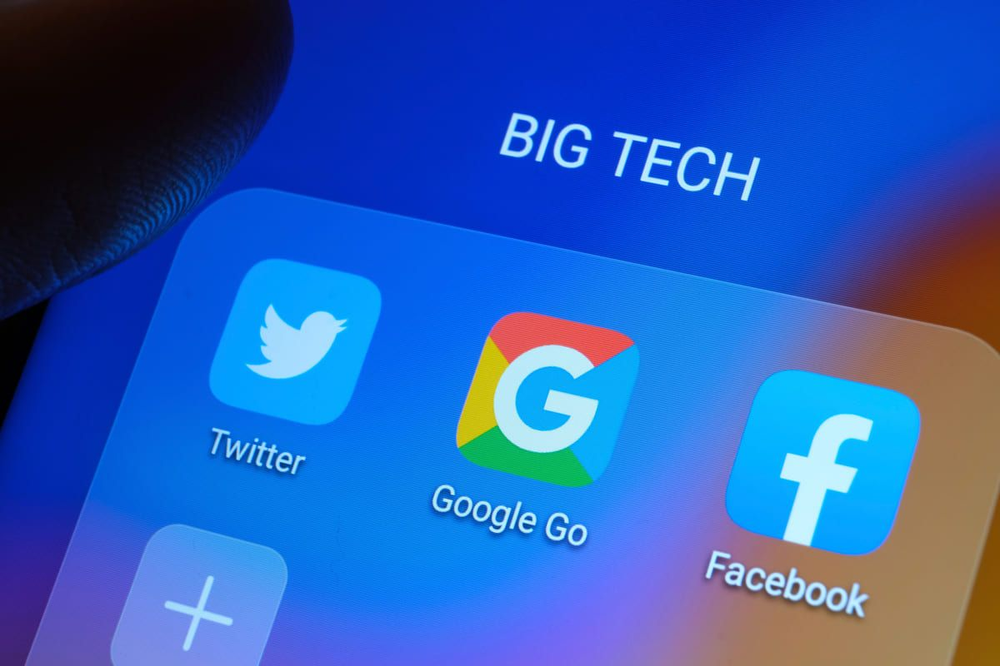

## Introduction

In today's digital age, privacy concerns are at the forefront of many discussions. With the dominance of big tech companies, it can feel like our every move online is being tracked and monitored. But what if I told you there's a way to reclaim your digital privacy without sacrificing convenience? Enter Free and Open Source Software (FOSS) Android apps. Let me take you through my daily routine, powered by FOSS apps, that replace the mainstream alternatives.

## Privacy & Security Tools

### SimpleLogin

Protecting email privacy by creating unique aliases for every service, shielding the primary email from spam and tracking.

### Mullvad VPN

Encrypting internet connections to keep data private and secure from prying eyes.

### PCAPdroid

Monitoring network traffic on the device to identify connections, Just like wireshark.

### microG

A free and open-source reimplementation of Google’s proprietary libraries, allowing for a more privacy-respecting Android experience.

### GrapheneOS

A privacy-focused Android operating system that prioritizes security and user control, protecting the device from security threats.

### URL Cleaner

Automatically removes tracking parameters from URLs, preserving browsing privacy.

## Messengers

### SimpleX Chat

Redefines secure messaging with two-layer end-to-end encryption, ensuring privacy in communications.

### Molly

A privacy-focused fork of Signal messenger, enhancing push notifications and operating independently from Google Mobile Services (GMS).

## Email Services

### Tuta

Provides secure communication with end-to-end encryption and zero-tracking policies.

### Proton Mail

Offers encrypted email services as part of a comprehensive suite of digital privacy tools.

## Cloud Storage

### Proton Drive

Part of the Proton suite, offering secure cloud storage with photo auto-sync and encrypted storage solutions.

### ente Photos

End-to-end encrypted photo storage, keeping photos organized and secure with local storage options.

### MEGA

Provides secure, encrypted cloud storage with generous free tiers and cross-platform support.

## App Stores

### NeoStore

Provides a convenient interface for accessing the vast repository of FOSS apps on F-Droid.

### Aurora Store

Allows downloading and updating apps from the Google Play Store anonymously, without the need for a Google account.

## Browsers

### Mull

A privacy-focused fork of the Firefox browser, removing trackers and other privacy-invading elements for a more secure browsing experience.

### Brave

Blocks ads and trackers by default, offering a faster and safer browsing experience.

## YouTube Clients

### NewPipe

A lightweight YouTube client that allows watching videos and listening to music without compromising privacy by avoiding tracking and ads.

### LibreTube

Built on NewPipe, fetching videos from the Piped.video API to provide a decentralized and privacy-focused platform for watching online content.

## Utility & Productivity

### KeePassDX

Securely manages passwords, storing credentials in an encrypted database accessible only with a master password or key file.

### LocalSend

Utilizes peer-to-peer technology for fast and secure file sharing over local networks.

### KDE Connect

Integrates Android devices with desktop environments for file sharing, notifications, and remote control across devices.

### CuteCalc

A fully functional calculator app with a charming design.

### Quillpad

Allows taking notes with true offline capabilities, without the risk of data being stolen.

### Binary Eye

Scans QR codes without compromising privacy.

### Coffee

Prevents the screen from timing out, ensuring it stays on when needed without tracking personal data.

## Launchers & Customization

### Neo Launcher

A lightweight, privacy-focused alternative to traditional Android launchers, providing a customizable user experience.

## Galleries & Media

### Aves

A secure gallery app ensuring images and photos are stored with privacy and protection in mind.

## Take back our Privacy

Offers a one-stop solution for digital privacy, including encrypted email services, VPN protection, secure cloud storage, password management, and a private calendar.

With these FOSS Android apps, you can take back control of your digital life, prioritizing privacy and security without sacrificing functionality. Reclaim your online privacy with these FOSS alternatives to mainstream apps.
