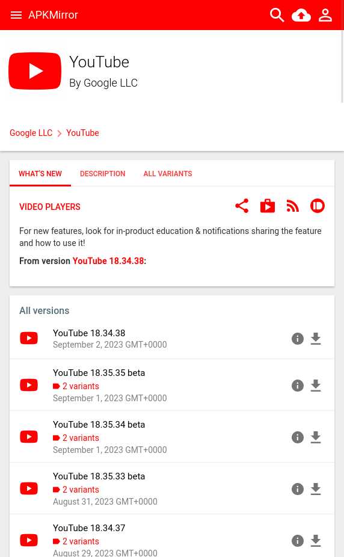
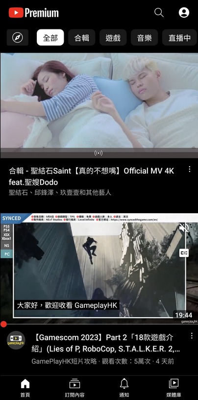

## Introduction

ReVanced Manager is powerful software that allows you to customize your Android applications by applying patches to remove ads, enhance your user experience, and unlock additional features. With ReVanced Manager, you can tailor popular apps like YouTube, YouTube Music, Reddit, Twitch, and more to your preferences. Say goodbye to unwanted ads and enjoy a seamless and ad-free experience on your Android device.

### Step 1: Download ReVanced Manager

Download ReVanced Manager from the [official website](https://revanced.app/download). Alternatively, you can find it on GitHub [here](https://github.com/revanced/revanced-manager).

### Step 2: Download Your Target APK

ReVanced Manager don't provide the APKs of the apps you want to customize. So you need to download the APKs of the apps from other sources. As the example, i'll use [APKMirror](https://www.apkmirror.com/) to download the APK of the [youtube](https://www.apkmirror.com/apk/google-inc/youtube/).

### Step 3: Build Your Customized APK

Now, it's time to use ReVanced Manager to create your ad-free and customized APK. Follow these steps:

1. **Open ReVanced Manager:** Launch ReVanced Manager on your Android device.

2. **Select an Application:** In the ReVanced Manager interface, tap on `Patcher` Selection, then click `Select an application.`

3. **Load Your APK:** On the `Select an application` screen, tap the `Storage` button, and choose the APK you downloaded earlier from your device's storage.

4. **Choose Your Features:** By default, ReVanced Manager provides a set of predefined choices. If you want to customize these settings, enable the `Enable changing selection` option in the app's settings.

5. **Patch Your APK:** After you've made your feature selections, click the `Patch` button. This initiates the process of creating your customized APK.

6. **Wait for Compilation:** The compilation process may take some time, typically around 5-10 minutes, depending on your device's CPU speed.

7. **Install or Export:** Once the compilation is complete, you'll have the option to either install the customized app directly or export it as an APK file. You can share this customized APK with friends or keep it as a backup.

### Final Step: Install Vanced MicroG

To ensure that your custom app works seamlessly, you'll need Vanced MicroG. This component enables Google push notifications (GCM). Download Vanced MicroG from [here](https://github.com/TeamVanced/VancedMicroG/releases).

### Preview: Your Custom YouTube

Once you've successfully installed your custom YouTube app, you'll notice the absence of ads, and the app's icon may change to resemble YouTube Premium. Enjoy a seamless and ad-free mobile experience!

## In Conclusion

With over 52 additional functions, ReVanced Manager supercharges your YouTube experience. From removing those ads and enabling more features to customizing the app's appearance.
