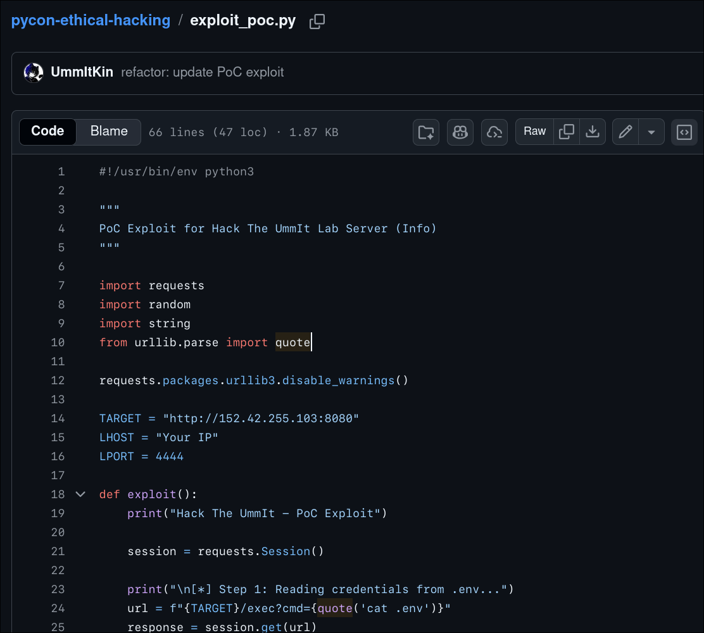

## 第一次上台做 Talk？都幾緊張 lol

呢篇文其實遲咗好多先寫，個 Talk 都係上年嘅事啦 XDDD ~~成兩個月前喇~~

首先真係要多謝 PyCon 俾呢個機會我上台分享同埋教人 :) ~~雖然佢地係捉咗我去講~~

自己其實本身就好鍾意教人嘅。

今次借呢個機會可以直接喺台上發表教學，真係幾正！

`Sat, Nov 29, 2025 · 4:00 PM to 6:00 PM CST`

> HKPUG #92 - The Hacker and Refactor

---

## 個 Talk 講緊咩？

如果有人唔知我個 Talk 講咩嘅話，簡單嚟講就係我去咗 PyCon 嘅某場 Event 教大家點用 Python 做 Ethical Hacking :)

Title 就係咁：`Introduction to Ethical Hacking in Python`

Recap 內容可以睇返：https://www.meetup.com/pythonhk/events/311740779

不過咁喎，話就話 Python... 但其實我唔記得咗喺 Talk 入面 Mention 返點樣用 Python 做 attack XDD

我仲整咗 PoC script 俾大家用，不過無用到。

其實你係可以去返 GitHub 個 Repo 睇返，係有條 Exploit Script 㗎！

Repo: https://github.com/UmmItKin/pycon-ethical-hacking

條 Script 只係自動化咗上面可以用嚟 Exploit 嘅 action 啫 :D

呢個都算係一個細嘅 lab 嚟㗎 (?

不過好似唔係好多人有跟住一齊做 XDDD

---

## 感受?

整體嚟講，我講到半路先開始無咁緊張...

老實講，今次準備得唔算太好...

個 Slide 都係就快講嗰陣仲執緊 XD

12 月尾嗰陣又考緊試又要溫書，時間真係唔夠用。

今次 Talk 嚟講，我覺得自己做得未夠好，時間上都有啲尷...

下次會講多啲野 :)

topic 方面應該都會離唔開 Offensive. eg:

`Obfuscator`, `MITM`, `Web Attack`

睇下大家想聽咩 :D

新年快樂 lolll
